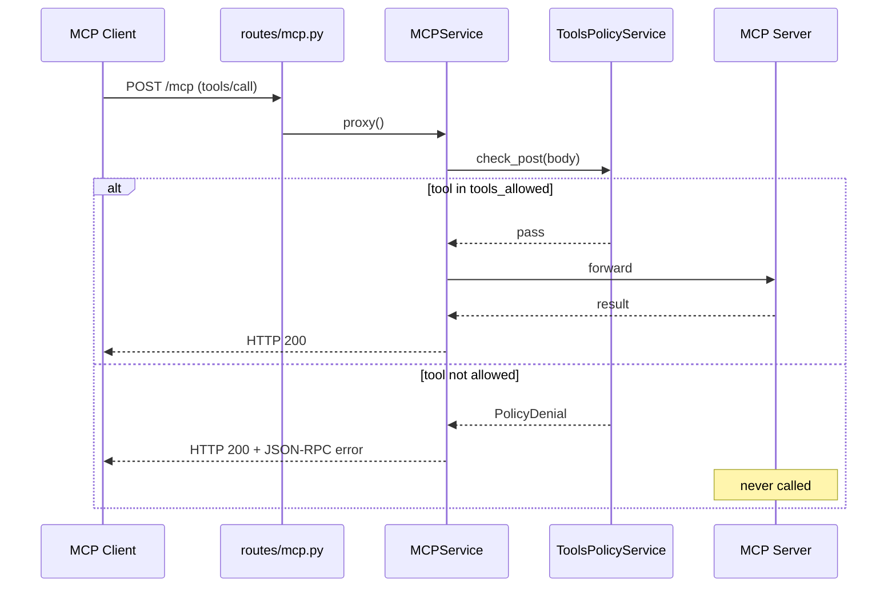
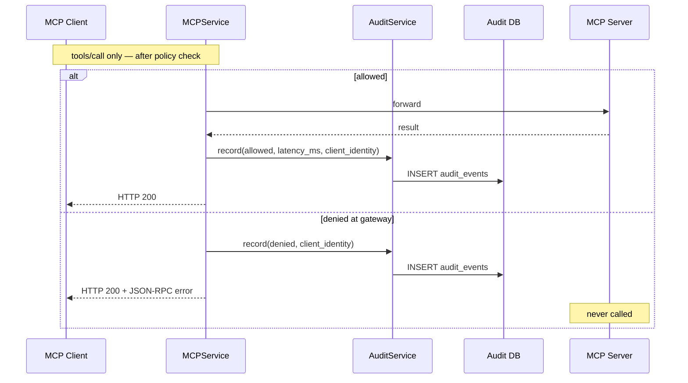
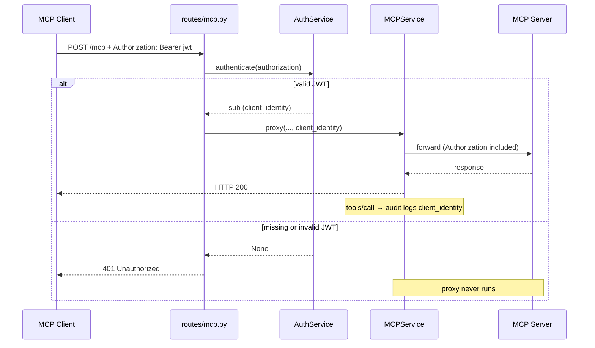
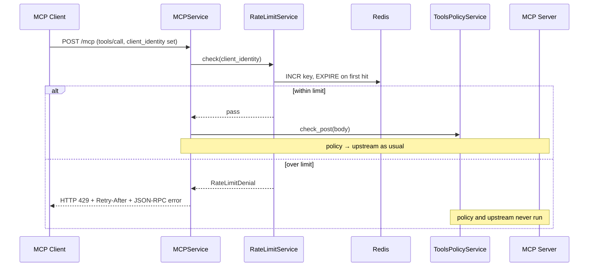
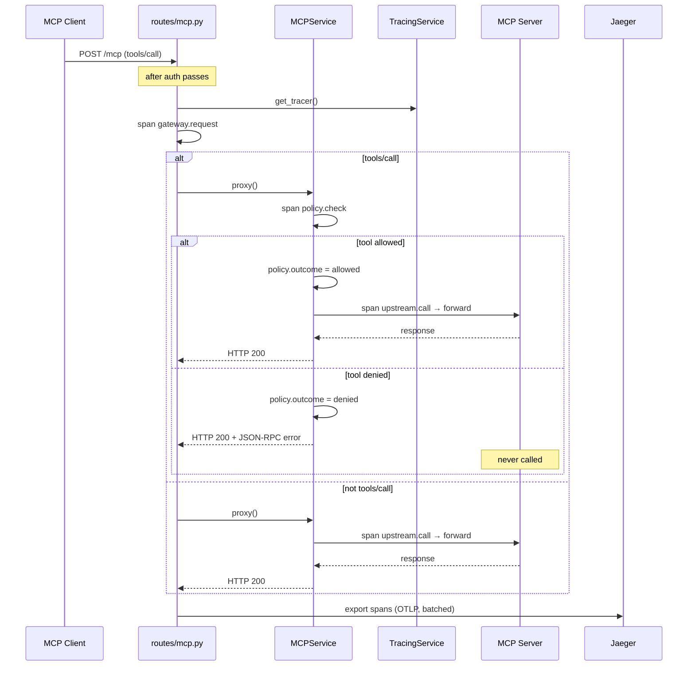

# MCP Gateway — Documentation

Design reference for the gateway. For how to run and test locally, see [README.md](./README.md).

---

## Problem

Agents and apps call MCP tools directly with little governance:

- No centralized auth at the tool boundary
- No allow/deny policies per tool
- Weak audit trails for production debugging
- No single place to observe or control tool traffic

This project is a **control-plane gateway** — a single choke point between MCP clients and MCP servers. It is not an agent framework.

---

## Transport: Streamable HTTP

The gateway sits between clients and upstream MCP servers on a single `/mcp` endpoint. One client run is not a single HTTP call — Streamable HTTP opens a session, streams on a GET, sends RPCs over POST, then closes with DELETE:


| Call              | Why                                                      |
| ----------------- | -------------------------------------------------------- |
| `POST /mcp` 200   | `initialize`                                             |
| `POST /mcp` 202   | Session created (`Mcp-Session-Id`)                       |
| `GET /mcp` 200    | SSE stream — server can push messages on that connection |
| `POST /mcp` 200   | `tools/list`, `tools/call`, …                            |
| `DELETE /mcp` 200 | Client closes the session                                |


Allowed traffic shows the same pattern on `:8080` (gateway) and `:8000` (upstream). Flow: **client → gateway → server**.

MCP-relevant headers (`Mcp-Session-Id`, `Accept`, `Content-Type`, …) are forwarded; hop-by-hop headers are stripped. SSE responses are streamed without buffering the full body.

---

## Architecture

```
Agent / Client  →  MCP Gateway  →  MCP Server(s)
                        │
                        ├─ Auth (JWT HS256)
                        ├─ Rate limit (Redis — tools/call per client)
                        ├─ Tool policy (allow/deny tools)
                        ├─ Audit log (who called what, when)
                        └─ Tracing (OpenTelemetry)
```

---

## Tool policy

Decide which tools may run before they hit upstream. Applies **only** to incoming `POST` bodies where JSON-RPC `method == "tools/call"`. Everything else (`initialize`, `tools/list`, GET, DELETE) passes through unchanged.

### Flow




### Config

Policy lives in `[policy.yaml](./policy.yaml)` at the repo root:

```yaml
tools_allowed:
  - echo
```

- **Allow-list, default deny** — only listed tools may run; anything else is blocked at the gateway before reaching upstream.
- **Why allow-list over deny-list** — for a governance gateway, default deny is the safer posture. A new tool added upstream is automatically blocked until explicitly permitted. A deny-list would silently allow it.
- **Extensible schema** — future keys (e.g. `resources_allowed`) can live in the same file without renaming the loader.
- **Docker** — `policy.yaml` is bind-mounted into the gateway container; edit and restart, no image rebuild.

Configuration: upstream URL via `GATEWAY_UPSTREAM_URL` (default `http://127.0.0.1:8000/mcp`, see `.env.example`); gateway listens on `0.0.0.0:8080`; missing or invalid `policy.yaml` exits at startup.

**Why only `tools/call`?** That is where side effects happen — API calls, writes, shell commands. Discovery and read paths stay untouched; control is applied at the execution boundary only.

**Why only `POST`?** All JSON-RPC calls travel over POST with a body. GET opens an SSE stream; DELETE closes a session — neither carries a `tools/call` payload.

### Denial response

Denied calls return **HTTP 200** with a JSON-RPC error body:

```json
{
  "jsonrpc": "2.0",
  "id": "<request id>",
  "error": {
    "code": -32000,
    "message": "Tool 'ping' denied by gateway policy"
  }
}
```

**Why HTTP 200, not 4xx?** MCP / JSON-RPC treats HTTP as transport. The real result lives in the message envelope — `result` on success, `error` on failure — both on HTTP 200. Returning a 403 would break MCP clients that expect a parseable JSON-RPC body, and it conflates "bad HTTP request" with "valid request, blocked by policy". MCP clients surface this as a failed tool call; a chat UI shows the error message, not an HTTP status code. Denied calls **never reach upstream**.

---

## Audit log

Append-only record of every `tools/call` — for debugging and compliance.

### Flow



Denied calls are logged **before** the policy error is returned. Allowed calls are logged after a successful upstream response. Gateway errors (502/504) are not audited.

**Rate limited** — when auth is on and a client exceeds its `tools/call` budget, the gateway logs `outcome = rate_limited` and returns **429** before policy or upstream run. Same fields as a denial (`latency_ms = 0`); only the outcome differs. Auth off → no rate limit, so no `rate_limited` rows.

### What gets logged

| Field             | Description                                                          |
| ----------------- | -------------------------------------------------------------------- |
| `timestamp`       | UTC ISO-8601                                                         |
| `tool_name`       | From JSON-RPC `params.name`                                          |
| `outcome`         | `allowed`, `denied`, or `rate_limited`                             |
| `latency_ms`      | Upstream round-trip for allowed calls; `0` for denials and rate limits |
| `request_id`      | JSON-RPC `id`                                                        |
| `client_identity` | JWT `sub` claim from authenticated client; `NULL` when auth disabled |


### Storage

Configured via `GATEWAY_AUDIT_DB_PATH`:


| Environment    | Value                                | Backend                   |
| -------------- | ------------------------------------ | ------------------------- |
| Local `uv run` | `data/audit.db` (default)            | SQLite file, auto-created |
| Docker Compose | `postgresql://…@postgres:5432/audit` | Postgres service          |


Postgres credentials live in `.env` (`POSTGRES_USER`, `POSTGRES_PASSWORD`, `POSTGRES_DB`). Compose builds the gateway URL from those vars.

---

## Auth (JWT)

Ingress authentication on `/mcp` only. `/health` (liveness) and `/health/upstream` (readiness — probes upstream, 503 if unreachable) stay public. Runs **before** rate limit, policy, and audit.

### Config


| Variable             | Description                                 |
| -------------------- | ------------------------------------------- |
| `GATEWAY_JWT_SECRET` | HS256 shared secret. Unset = auth disabled. |


### Flow




Identity comes from the JWT `sub` claim — not from a client-supplied header. The gateway validates; it does not issue tokens. When `GATEWAY_JWT_SECRET` is unset, `authenticate` is a no-op and all requests pass through without identity.

### What we ship today (local approach)

Current auth is a **dev/local shortcut only**:

- One HS256 shared secret (`GATEWAY_JWT_SECRET`) — gateway validates, smoke client signs
- `mcp-client` auto-signs a JWT with a stand-in `CLIENT` object (`sub: smoke-client`)
- No `/login` route, no IdP integration, no token refresh

This is **not** a production auth setup.

### Production target (not implemented yet)


| Piece              | Production approach                                                      |
| ------------------ | ------------------------------------------------------------------------ |
| **Who signs?**     | `/login` route or external IdP (Auth0, Keycloak, …) — not the MCP client |
| **Who validates?** | Gateway only — same `sub` → `client_identity` flow as today              |
| **Secret**         | Client never holds the signing secret; it only sends a token it received |


Secret rotation changes the key, not `sub` — audit identity stays stable.

### Denial

Missing or invalid token → **HTTP 401** before policy or audit run:

```json
{ "detail": "Unauthorized" }
```

---

## Rate limiter

Cap how many `tools/call` requests each authenticated client may send in a time window. Hook lives in `MCPService.proxy()` — **after** auth resolves `client_identity`, **before** policy and upstream.

Applies **only** to incoming `POST` bodies where JSON-RPC `method == "tools/call"`. When auth is disabled (`GATEWAY_JWT_SECRET` unset), there is no identity to key on — rate limiting is skipped entirely.

### Flow



### Limits

Fixed in `[src/services/rate_limit.py](./src/services/rate_limit.py)`:

| Constant | Value | Meaning |
| -------- | ----- | ------- |
| `RATE_LIMIT_CALLS` | `10` | Allowed `tools/call` requests per client per window |
| `RATE_LIMIT_WINDOW_SEC` | `60` | Fixed window length (seconds) |
| `RATE_LIMIT_DENIED_CODE` | `-32001` | JSON-RPC error code on denial |

**Algorithm** — fixed window per client: Redis `INCR` on key `mcp-gateway:rate_limit:{client_identity}`; `EXPIRE` set on the first increment. Counts are shared across gateway instances (unlike in-process counters).

**Scaling** — if you run multiple gateway replicas, they all share the same Redis counters. Scale Redis with the gateway (managed service, HA, enough headroom) — a single local Redis container is fine for dev, not for production load.

**Scope** — one bucket per JWT `sub` (`client_identity`).

### Config

| Variable | Description |
| -------- | ----------- |
| `GATEWAY_REDIS_URL` | Redis connection URL (default `redis://127.0.0.1:6379/0`) |

| Environment | Typical value |
| ----------- | ------------- |
| Local `uv run` | `redis://127.0.0.1:6379/0` — start Redis on `:6379` yourself, or let `e2e-local.sh` start a container |
| Docker Compose | `redis://redis:6379/0` — compose overrides; `redis` service in `[docker/docker-compose.yaml](./docker/docker-compose.yaml)` |

### Denial response

Over limit → **HTTP 429** with a `Retry-After` header (seconds until the window resets) and a JSON-RPC error body:

```json
{
  "jsonrpc": "2.0",
  "id": "<request id>",
  "error": {
    "code": -32001,
    "message": "Rate limit exceeded for tool 'echo' (client 'smoke-client')"
  }
}
```

**Why HTTP 429, not 200?** Policy denials use HTTP 200 because the request was valid but blocked by gateway rules. Rate limiting is a transport-level throttle — **429** + `Retry-After` is the standard signal for “try again later”, which clients, proxies, and retries understand without parsing JSON-RPC.

Side effects on deny: audit row with `outcome = rate_limited` (see [Audit log](#audit-log)); OpenTelemetry span `rate_limit.check` with `tool.name`, `client.identity`, and `rate_limit.outcome = rate_limited`.

---

## Tracing (OpenTelemetry)

Distributed traces for every authenticated `/mcp` request — latency breakdown across the gateway layers. Spans export via OTLP HTTP when configured; unset endpoint = tracing disabled (no overhead).

Auth failures (**401**) are **not** traced — `authenticate` runs before the route handler, so no `gateway.request` span is created.

### Flow



Each HTTP request to `/mcp` is one trace. `tools/call` adds `rate_limit.check` (when authenticated) and `policy.check`; denied or rate-limited calls stop before `upstream.call`.

### Config

| Variable | Description |
| -------- | ----------- |
| `GATEWAY_OTEL_EXPORTER_ENDPOINT` | OTLP HTTP URL. Unset = tracing off. |
| `GATEWAY_OTEL_SERVICE_NAME` | Service name on exported spans (default `mcp-gateway`). |

`TracingService` starts in app lifespan (`start()` / `shutdown()`). Shutdown flushes batched spans on exit.

### Spans

Nested waterfall — one trace per `/mcp` HTTP request:

```
gateway.request          ← routes/mcp.py
  ├─ rate_limit.check    ← services/mcp.py (tools/call + auth only)
  ├─ policy.check        ← services/mcp.py (tools/call only)
  └─ upstream.call       ← services/mcp.py (skipped when rate limit or policy denies)
```

| Span | Attributes | When |
| ---- | ---------- | ---- |
| `gateway.request` | `http.method`, `http.route`, `client.identity`, `http.status_code` | Every authenticated `/mcp` request |
| `rate_limit.check` | `tool.name`, `client.identity`, `rate_limit.outcome` (`allowed` / `rate_limited`) | `tools/call` POST when auth provides identity |
| `policy.check` | `tool.name`, `policy.outcome` (`allowed` / `denied`) | `tools/call` POST only |
| `upstream.call` | `upstream.url`, `http.status_code` | Request reaches upstream (502/504 on failure) |

**Why layered spans?** Each span answers one question: how long at the HTTP boundary (`gateway.request`), was policy involved (`policy.check`), how slow was upstream (`upstream.call`).

