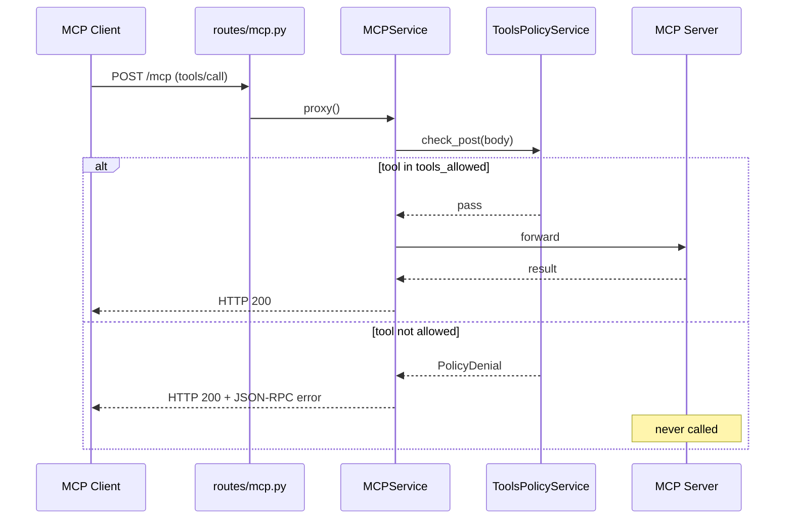

# MCP Gateway — Documentation

Design reference for the gateway. For how to run and test locally, see [README.md](./README.md).

---

## Problem

Agents and apps call MCP tools directly with little governance:

- No centralized auth at the tool boundary
- No allow/deny policies per tool
- Weak audit trails for production debugging
- No single place to observe or control tool traffic

This project is a **control-plane gateway** — a single choke point between MCP clients and MCP servers. It is not an agent framework.

---

## Architecture

```
Agent / Client  →  MCP Gateway  →  MCP Server(s)
                        │
                        ├─ Tool policy (allow/deny tools)
                        ├─ Audit log (who called what, when)
                        ├─ Auth (API keys / OAuth)
                        └─ Tracing (OpenTelemetry)
```

**Working in progress**: More capabilities (audit log, auth, tracing) will get their own sections and diagrams as they land.

### Tool policy



Everything else (`initialize`, `tools/list`, GET, DELETE) skips policy and passes through unchanged.

---

## Transport: Streamable HTTP

The gateway sits between clients and upstream MCP servers on a single `/mcp` endpoint. One client run is not a single HTTP call — Streamable HTTP opens a session, streams on a GET, sends RPCs over POST, then closes with DELETE:

| Call | Why |
|------|-----|
| `POST /mcp` 200 | `initialize` |
| `POST /mcp` 202 | Session created (`Mcp-Session-Id`) |
| `GET /mcp` 200 | SSE stream — server can push messages on that connection |
| `POST /mcp` 200 | `tools/list`, `tools/call`, … |
| `DELETE /mcp` 200 | Client closes the session |

Allowed traffic shows the same pattern on `:8080` (gateway) and `:8000` (upstream). Flow: **client → gateway → server**.

MCP-relevant headers (`Mcp-Session-Id`, `Accept`, `Content-Type`, …) are forwarded; hop-by-hop headers are stripped. SSE responses are streamed without buffering the full body.

---

## Tool policy

### Config

Policy lives in [`policy.yaml`](./policy.yaml) at the repo root:

```yaml
tools_allowed:
  - echo
```

- **Allow-list, default deny** — only listed tools may run; anything else is blocked at the gateway before reaching upstream.
- **Why allow-list over deny-list** — for a governance gateway, default deny is the safer posture. A new tool added upstream is automatically blocked until explicitly permitted. A deny-list would silently allow it.
- **Extensible schema** — future keys (e.g. `resources_allowed`) can live in the same file without renaming the loader.
- **Docker** — `policy.yaml` is bind-mounted into the gateway container; edit and restart, no image rebuild.

Configuration: upstream URL via `GATEWAY_UPSTREAM_URL` (default `http://127.0.0.1:8000/mcp`, see `.env.example`); gateway listens on `0.0.0.0:8080`; missing or invalid `policy.yaml` exits at startup.

Policy applies **only** to incoming `POST` bodies where JSON-RPC `method == "tools/call"`.

**Why only `tools/call`?** That is where side effects happen — API calls, writes, shell commands. Discovery and read paths stay untouched; control is applied at the execution boundary only.

**Why only `POST`?** All JSON-RPC calls travel over POST with a body. GET opens an SSE stream; DELETE closes a session — neither carries a `tools/call` payload.

### Denial response

Denied calls return **HTTP 200** with a JSON-RPC error body:

```json
{
  "jsonrpc": "2.0",
  "id": "<request id>",
  "error": {
    "code": -32000,
    "message": "Tool 'ping' denied by gateway policy"
  }
}
```

**Why HTTP 200, not 4xx?** MCP / JSON-RPC treats HTTP as transport. The real result lives in the message envelope — `result` on success, `error` on failure — both on HTTP 200. Returning a 403 would break MCP clients that expect a parseable JSON-RPC body, and it conflates "bad HTTP request" with "valid request, blocked by policy". MCP clients surface this as a failed tool call; a chat UI shows the error message, not an HTTP status code. Denied calls **never reach upstream**.

---

## Design principles

1. **One insertion point** — no bypass paths around the gateway
2. **Transport first, semantics later** — forward bytes by default; parse JSON-RPC only where control is needed
3. **Config over code** — upstream and policy in env/files, not hard-coded
4. **Test the wire** — every capability ships with an e2e smoke test (`./tests/e2e-local.sh`, `./tests/e2e-docker.sh`)
