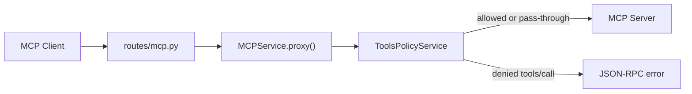

# MCP Gateway — Documentation

Design reference for the gateway. For how to run and test locally, see [README.md](./README.md).

---

## Problem

Agents and apps call MCP tools directly with little governance:

- No centralized auth at the tool boundary
- No allow/deny policies per tool
- Weak audit trails for production debugging
- No single place to observe or control tool traffic

This project is a **control-plane gateway** — a single choke point between MCP clients and MCP servers. It is not an agent framework.

---

## Architecture

```
Agent / Client  →  MCP Gateway  →  MCP Server(s)
                        │
                        ├─ Tool policy (allow/deny tools)
                        ├─ Audit log (who called what, when)
                        ├─ Auth (API keys / OAuth)
                        └─ Tracing (OpenTelemetry)
```



### Layers

| Layer | Path | Role |
|-------|------|------|
| HTTP adapter | `src/routes/` | FastAPI routes; wire services; no business logic |
| Orchestration | `src/services/` | Proxy, policy checks, future audit/auth hooks |
| Config | `src/config.py` | Env vars + `policy.yaml` loaded at startup |
| Entrypoint | `src/main.py` | App wiring, lifespan, `uvicorn.run` |

**Composition root:** `routes/mcp.py` constructs `ToolsPolicyService` and `MCPService` per request. Policy is loaded once at startup via `load_config()`.

**Insertion point:** `MCPService.proxy()` — by default the gateway forwards bytes unchanged. Each new control-plane capability adds a hook here without rewriting the proxy.

---

## Transport: Streamable HTTP

The gateway sits between clients and upstream MCP servers on a single `/mcp` endpoint. One client run is not a single HTTP call — Streamable HTTP opens a session, streams on a GET, sends RPCs over POST, then closes with DELETE:

| Call | Why |
|------|-----|
| `POST /mcp` 200 | `initialize` |
| `POST /mcp` 202 | Session created (`Mcp-Session-Id`) |
| `GET /mcp` 200 | SSE stream — server can push messages on that connection |
| `POST /mcp` 200 | `tools/list`, `tools/call`, … |
| `DELETE /mcp` 200 | Client closes the session |

Allowed traffic shows the same pattern on `:8080` (gateway) and `:8000` (upstream). Flow: **client → gateway → server**.

MCP-relevant headers (`Mcp-Session-Id`, `Accept`, `Content-Type`, …) are forwarded; hop-by-hop headers are stripped. SSE responses are streamed without buffering the full body.

---

## Tool policy

### Config

Policy lives in [`policy.yaml`](./policy.yaml) at the repo root:

```yaml
tools_allowed:
  - echo
```

- **Allow-list, default deny** — only listed tools may run; anything else is blocked at the gateway before reaching upstream.
- **Why allow-list over deny-list** — for a governance gateway, default deny is the safer posture. A new tool added upstream is automatically blocked until explicitly permitted. A deny-list would silently allow it.
- **Extensible schema** — future keys (e.g. `resources_allowed`) can live in the same file without renaming the loader.
- **Docker** — `policy.yaml` is bind-mounted into the gateway container; edit and restart, no image rebuild.

### What gets checked

Policy applies **only** to incoming `POST` bodies where JSON-RPC `method == "tools/call"`.

| Traffic | Behavior |
|---------|----------|
| `tools/call` + tool in `tools_allowed` | Forward to upstream |
| `tools/call` + tool not in `tools_allowed` | Deny at gateway |
| `initialize`, `tools/list`, resources, prompts | Pass-through |
| `GET` (SSE), `DELETE` | Pass-through |

**Why only `tools/call`?** That is where side effects happen — API calls, writes, shell commands. Discovery and read paths stay untouched; control is applied at the execution boundary only.

**Why only `POST`?** All JSON-RPC calls travel over POST with a body. GET opens an SSE stream; DELETE closes a session — neither carries a `tools/call` payload.

### Denial response

Denied calls return **HTTP 200** with a JSON-RPC error body:

```json
{
  "jsonrpc": "2.0",
  "id": "<request id>",
  "error": {
    "code": -32000,
    "message": "Tool 'ping' denied by gateway policy"
  }
}
```

**Why HTTP 200, not 4xx?** MCP / JSON-RPC treats HTTP as transport. The real result lives in the message envelope — `result` on success, `error` on failure — both on HTTP 200. Returning a 403 would break MCP clients that expect a parseable JSON-RPC body, and it conflates "bad HTTP request" with "valid request, blocked by policy". MCP clients surface this as a failed tool call; a chat UI shows the error message, not an HTTP status code. Denied calls **never reach upstream**.

---

## Configuration reference

| Setting | Source | Default | Notes |
|---------|--------|---------|-------|
| Upstream URL | `GATEWAY_UPSTREAM_URL` env | `http://127.0.0.1:8000/mcp` | Streamable HTTP endpoint |
| Listen address | hardcoded | `0.0.0.0:8080` | Gateway port |
| Tool policy | `policy.yaml` | required at startup | `tools_allowed` list |

Invalid config or missing `policy.yaml` → gateway exits at startup with a clear error.

---

## Design principles

1. **One insertion point** — no bypass paths around the gateway
2. **Transport first, semantics later** — forward bytes by default; parse JSON-RPC only where control is needed
3. **Config over code** — upstream and policy in env/files, not hard-coded
4. **Test the wire** — every capability ships with an e2e smoke test (`./tests/e2e-local.sh`, `./tests/e2e-docker.sh`)

---

## Project layout

```
src/
  config.py           # GatewayConfig, policy loading
  main.py             # FastAPI app + entrypoint
  routes/
    mcp.py            # /mcp proxy route
    health.py         # GET /health
  services/
    mcp.py            # MCPService — upstream proxy
    tools_policy.py   # ToolsPolicyService — tools/call allow-list
policy.yaml           # Tool policy (tools_allowed)
mcp-server/           # Demo upstream (echo, ping)
mcp-client/           # Smoke-test client
docker/               # Dockerfile + compose stack
tests/                # e2e-local.sh, e2e-docker.sh
```
